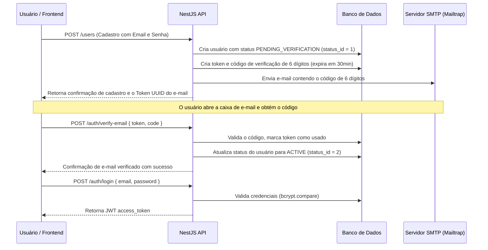

# Documentação do Sistema - Portfolio Manager

Esta documentação descreve a arquitetura do sistema, o esquema do banco de dados, os fluxos principais e as rotas da API do **Portfolio Manager**.

---

## 1. Arquitetura do Sistema

O backend foi construído usando o framework **NestJS** seguindo a modularização por recursos (Feature Modules). Cada funcionalidade/entidade possui seu próprio módulo que encapsula controladores, serviços e camadas de acesso a dados.

### Estrutura de Diretórios de um Módulo
Cada módulo dentro de `backend/src/modules/` segue o seguinte padrão:
```text
modules/{feature}/
├── {feature}.controller.ts         # Recebe requisições HTTP, valida payloads com DTOs e valida permissões (guards)
├── {feature}.service.ts            # Contém as regras de negócio e orquestração do módulo
├── {feature}.module.ts             # Declara controladores, provedores e gerencia a injeção de dependência
├── dto/                            # Data Transfer Objects (DTOs) com validações decoradas (class-validator)
├── entities/                       # Interfaces TypeScript representando o modelo de dados
└── repository/
    ├── {feature}.repository.ts     # Implementação concreta de acesso a dados usando o Prisma Client
    └── {feature}-in-memory.repository.ts  # Implementação opcional em memória utilizada em testes unitários
```

### Abstração de Acesso a Dados
Para simplificar a realização de testes unitários rápidos, os serviços dependem de repositórios que podem ser facilmente substituídos. Nos testes de unidade, em vez de conectar ao PostgreSQL com Prisma, injeta-se uma versão em memória que gerencia os dados localmente em vetores.

---

## 2. Esquema do Banco de Dados

O banco de dados utiliza o PostgreSQL gerenciado via Prisma ORM. O esquema está localizado em [schema.prisma](file:///d:/Development/PersonalProjects/portfolio_manager/backend/prisma/schema.prisma).

### Convenção de Nomenclatura das Tabelas
*   **Prefixo `d_` (Dimension/Lookup)**: Tabelas que guardam dados de suporte, configurações, tipos ou dados estáticos de consulta.
    *   `d_roles`: Perfis de usuário (`SYSADMIN`, `USER`).
    *   `d_status`: Status da conta do usuário (`ACTIVE`, `INACTIVE`, `PENDING_VERIFICATION`).
    *   `d_auth_method`: Método de autenticação (`LOCAL`, `GOOGLE`).
    *   `d_category`: Categorias de projetos.
    *   `d_technologies`: Tecnologias associadas aos projetos.
*   **Prefixo `f_` (Fact/Entity)**: Tabelas principais contendo as entidades de negócio.
    *   `users`: Usuários registrados no sistema.
    *   `email_verification_tokens`: Tokens UUID para validação de e-mail e ativação de contas.
    *   `f_images`: Registro de caminhos de arquivos de imagem salvos em disco.
    *   `f_profile_picture`: Tabela associativa que define a imagem de perfil do usuário.
    *   `f_projects`: Projetos do portfólio.
    *   `f_experience`: Experiências profissionais dos usuários.
    *   `f_education`: Formações acadêmicas dos usuários.
    *   `f_courses`: Cursos adicionais ou certificações dos usuários.
    *   `audit_logs`: Log de ações CRUD para auditoria de segurança.
    *   `custom_sections` e `custom_section_items`: Tabelas flexíveis com schemas JSON dinâmicos para criação de seções personalizadas.

---

## 3. Fluxos de Autenticação e Segurança

A segurança é garantida através de uma pilha de **Guards** do NestJS aplicados nos endpoints das rotas.

### Guarda de Rotas (Guards Stack)
Nos controladores privados do CMS, os guards são aplicados sequencialmente:
1.  **`JwtAuthGuard`**: Verifica se há um token JWT válido e expirado no cabeçalho `Authorization: Bearer <token>`. Decodifica o payload contendo o ID do usuário (`sub`), papel (`role`) e status (`status`).
2.  **`ActiveUserGuard`**: Valida se a conta do usuário que fez a requisição possui `status_id` correspondente a `ACTIVE`. Rejeita contas pendentes ou inativas.
3.  **`AdminGuard`** (opcional): Permite o acesso apenas se o papel do usuário logado for de administrador (`SYSADMIN`).

### Fluxo 1: Autenticação Local e Ativação de E-mail


### Fluxo 2: Autenticação via Google OAuth2
1.  O Frontend ou Usuário faz uma requisição HTTP GET para `/auth/google`.
2.  A API redireciona o usuário para a tela de login do Google.
3.  Após a autorização, o Google envia os dados do perfil do usuário para o callback `/auth/google/callback`.
4.  O [GoogleStrategy](file:///d:/Development/PersonalProjects/portfolio_manager/backend/src/modules/auth/strategies/google.strategy.ts) recebe o perfil e verifica se o email já existe na base de dados:
    *   Se **não existir**, a API cria o usuário com o método de autenticação configurado como `GOOGLE`, status `ACTIVE` e `verified_email` como `true`.
    *   Se **já existir**, recupera as informações do usuário.
5.  A API gera um JWT válido e redireciona o usuário de volta para o frontend apontando para `/auth/google/success?token=<JWT>`.

---

## 4. Principais Endpoints da API

### Rotas de Autenticação (`/auth`)
*   `POST /auth/login`: Autentica o usuário com email e senha locais. Retorna o token JWT.
*   `POST /auth/verify-email`: Valida o código de ativação enviado por e-mail.
*   `POST /auth/resend-verification`: Reenvia o código de ativação para o e-mail informado.
*   `GET /auth/google`: Redireciona para o fluxo de autenticação do Google.
*   `GET /auth/google/callback`: Rota de retorno do Google OAuth2.
*   `POST /auth/change-password` *(Protegido)*: Permite a alteração da senha atual do usuário logado.

### Rotas do Usuário (`/users`)
*   `POST /users`: Cria um novo usuário na plataforma (fluxo de auto-cadastro).
*   `GET /users/me` *(Protegido)*: Retorna os dados do perfil do usuário logado.

### Rotas de Conteúdo do CMS *(Todas protegidas por JWT e ActiveUser)*
Cada usuário gerencia apenas os seus próprios dados. O middleware valida a propriedade dos recursos.
*   **Projetos (`/projects`)**: CRUD de projetos do portfólio.
*   **Experiências (`/experience`)**: CRUD de histórico profissional do usuário.
*   **Formação Acadêmica (`/education`)**: CRUD de graduações, licenciaturas e pós-graduações.
*   **Cursos (`/courses`)**: CRUD de certificações e cursos extracurriculares.
*   **Categorias (`/category`)**: Gerencia categorias globais ou individuais para organizar projetos.
*   **Tecnologias (`/technologies`)**: CRUD de tags de habilidades e tecnologias usadas nos projetos.

### Rotas de Upload (`/uploads`)
*   `POST /uploads` *(Protegido)*: Envia um arquivo de imagem (JPEG, PNG, GIF). A API armazena o arquivo em `uploads/{userId}/` e cria uma referência na tabela `f_images`, associando-o ao usuário que realizou a ação.

### Seções Customizadas (`/custom-sections`)
Para permitir flexibilidade total no portfólio, os usuários podem criar seções dinâmicas definindo esquemas em JSON:
*   `POST /custom-sections`: Cria uma seção personalizada definindo seu nome, ícone e o esquema JSON dos campos.
*   `POST /custom-sections/:id/items`: Adiciona itens de dados estruturados à seção seguindo o formato definido no esquema.

### Rotas Públicas (`/public`)
As rotas de leitura pública são acessadas sem JWT e servem para renderizar os dados do portfólio de um usuário específico no frontend:
*   `GET /public/user/:userId`: Retorna os dados resumidos do perfil público do usuário.
*   `GET /public/projects/:userId`: Retorna a lista de projetos públicos do usuário especificado.
*   `GET /public/experience/:userId`: Retorna a lista de experiências profissionais públicas.
*   `GET /public/education/:userId`: Retorna a formação acadêmica pública.
*   `GET /public/courses/:userId`: Retorna os cursos e certificações públicas do usuário.

---

## 5. Auditoria do Sistema

Todas as operações de alteração de dados (criação, edição e deleção) são automaticamente capturadas pelo [AuditInterceptor](file:///d:/Development/PersonalProjects/portfolio_manager/backend/src/common/interceptors/audit.interceptor.ts) (quando aplicável).
*   Ele intercepta requisições nos controllers privados.
*   Salva no banco de dados na tabela `audit_logs` os seguintes metadados:
    *   ID do Usuário executor.
    *   Tipo da Entidade modificada (`entity_type`) e seu ID (`entity_id`).
    *   Ação executada (`CREATE`, `UPDATE`, `DELETE`).
    *   Endereço de IP de onde partiu a chamada.
    *   Payload original (`old_values`) e novos dados (`new_values`) para auditoria de segurança.

---

## 6. Problemas Conhecidos e Correções Recomendadas

### 1. Caminhos de importação no Jest E2E
**Sintoma**: Ao rodar `npm run test:e2e`, o Jest falha com `Cannot find module 'src/common/services/hash.service'`.
**Causa**: O Jest de ponta a ponta (E2E) roda fora do escopo direto de compilação do TypeScript `tsc` padrão e não herda os alias configurados em caminhos do tsconfig sem o mapeador do Jest estar ativo.
**Solução recomendada**: Editar o arquivo [jest-e2e.json](file:///d:/Development/PersonalProjects/portfolio_manager/backend/test/jest-e2e.json) adicionando suporte a alias de caminhos usando `moduleNameMapper`:
```json
{
  "moduleFileExtensions": ["js", "json", "ts"],
  "rootDir": ".",
  "testEnvironment": "node",
  "testRegex": ".e2e-spec.ts$",
  "transform": {
    "^.+\\.(t|j)s$": "ts-jest"
  },
  "moduleNameMapper": {
    "^src/(.*)$": "<rootDir>/../src/$1"
  }
}
```
E configurar o `modulePaths` para o diretório raiz do Nest.
